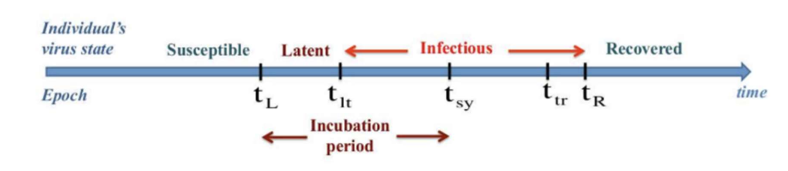

## SEIR
### Tempos de infecção para um modelo SEIR

A epidemiologia é a ciência que relaciona os diversos fatores que influenciam a ocorrência de doenças na população humana. Essa relação pode ser compreendida por meio da elaboração e da utilização de modelos epidemiológicos capazes fornecer informações qualitativas e quantitativas acerca das características de uma doença e sua disseminação.    
    
Um dos modelos epidemiológicos mais utilizados no mundo é o SEIR (Suscetíveis, Expostos, Infectados e Recuperados) (Li et. al, 1999). Trata-se de um modelo determinístico compartimentado. Isto é, a população estudada é dividida em compartimentos, a saber: Suscetíveis, Expostos, Infecciosos e Recuperados. A partir dessa divisão, observa-se como cada compartimento varia no tempo, podendo-se criar projeções do número de indivíduos que estará em cada um dos compartimentos no futuro.

Em sua forma mais básica, o modelo SEIR utiliza a seguinte equação populacional:

$N=S(t) + E(t) + I(t) + R(t)$

Desse modo, o total de indivíduos de uma população (N) é dividido nos compartimentos (S,E,I,R). No caso do Distrito Federal, por exemplo, N = 3.015.268 segundo estimativas do IBGE de julho de 2019. Para a COVID-19, por ser uma doença nova, considera-se que toda a população se encontra no compartimento dos suscetíveis, não havendo, portanto, imunização prévia. 
A partir do momento em que são introduzidos infecciosos, ocorrem as transições entre os compartimentos, à medida que o tempo passa. Cada uma das mudanças compartimentais se dá a determinadas taxas de variação. 

S – Representa o número de indivíduos suscetíveis à doença. No caso da COVID-19, considera-se que, no instante anterior à primeira infecção (t=0), toda a população é suscetível (N=S; E=I=R=0). Isto se dá porque a doença é nova, e não havia indivíduos com imunidade adquirida anteriormente.

E – Representa o número de indivíduos expostos à doença. Ou seja, infectados pela doença, mas que ainda não se encontram infecciosos. Em outras palavras, não possuem capacidade de infectar outros indivíduos em virtude do chamado período latente da doença, que será tratado posteriormente.

I – Representa o número de indivíduos infecciosos. Isto é, elementos que, após serem expostos e passarem pelo período de latência da doença, podem transmiti-la caso existam condições do mecanismo de transmissão atuar. No caso da COVID-19, pode-se citar o contato com gotículas provenientes da tosse de indivíduos infecciosos com o trato nasal de suscetíveis como exemplo de mecanismo de transmissão. Este compartimento pode ser expandido, desmembrando-se em I1, I2 e I3, em que o grau de infecção é dividido entre leve, grave e crítico, respectivamente. Isto dá origem ao modelo SEIIIR, no qual cada “I” possui determinada taxa de recuperação.

R – Representa o número de indivíduos recuperados. Esses indivíduos já não transmitem a doença e, para a COVID-19, supõe-se que a população recuperada não volta a ser suscetível. Chama-se a atenção neste caso para a inclusão, em alguns modelos, dos óbitos no compartimento de recuperados epidemiológicos para fins de simplificação. 

Com a evolução da epidemia o número de indivíduos dos compartimentos varia. Como dito anteriormente, este movimento populacional ocorre a taxas de variação no tempo, as quais são calculadas por meio de equações diferenciais ordinárias (MA, 2020).

$\frac{dS}{dt}= \frac{-β.IS}{N}$
  
$\frac{dE}{dt}= \frac{-β.IS}{N} - \theta E$  

$\frac{dI}{dt} =  \theta E -  \gamma I$ 

$\frac{dR}{dt} = \gamma I$
  

Este sistema de equações diferenciais ordinárias pode ser resolvido computacionalmente por meio de métodos numéricos. Entretanto, é importante estabelecer os valores dos fatores multiplicadores (\beta, \theta e \gamma) presentes em cada uma das equações supracitadas. 
Esses fatores representam a probabilidade de transmissão por contato, que para a COVID-19, pode ser obtida por meio das observações realizadas nos países que se encontram em estágio mais avançado da epidemia, e os períodos de transição entre os compartimentos do modelo. Esses períodos se dão de acordo com os tempos de latência, incubação e infecciosidade.

### Parâmetros do Sistema de Equações do Modelo SEIR

O primeiro parâmetro relevante para a obtenção da evolução da doença na população em um dado instante do tempo é a taxa de transmissão por indivíduo infeccioso (\beta), a qual é fornecida pela seguinte expressão:

$\beta = \frac{R_{0}}{t_{infec}}$  

Em que \R_{0}  é o chamado número reprodutivo básico, entendido como o número médio de indivíduos que um único elemento infeccioso é capaz de infectar. Este fator é uma característica da doença, sendo que, quanto mais infecciosa ela for, maior será seu número reprodutivo básico. Em outras palavras, mais pessoas poderão ser infectadas a partir de um indivíduo infeccioso. 
R_0 pode ser obtido por meio da observação do comportamento da doença em uma população já afetada, ou por meio de uma relação entre os períodos latente e infeccioso e a taxa de crescimento de infecções (growth rate - \lambda).

$R_{0}=\frac{(\lambda+\gamma)‚àô(\lambda+\theta)}{(\gamma‚àô\theta)} $ 

No caso da aplicação do modelo utilizado pela Unidade de Situação da operação COVID-19 do CBMDF para análise de dados, a obtenção do número reprodutivo básico pode ser realizada das duas formas a depender da observação e da projeção pretendida.
Já o \t_{infec} é dado pelo tempo médio que um elemento da população se encontra infeccioso, ou seja, é capaz de transmitir a doença. Fornece o período infeccioso, que corresponde ao período durante o qual o infeccioso pode passar a doença para um suscetível. É o intervalo de tempo que o indivíduo permanece no compartimento dos infecciosos. A variável \gamma pode ser interpretada como a taxa de recuperação dos indivíduos, pois após o período infeccioso os elementos deslocam-se para o compartimento dos recuperados.

$\gamma=\frac{1}{t_{infec}}$     

O chamado período de latência e é dado pela razão de 1/\theta.

$\theta=\frac{1}{t_{latente}}$     

Logo, o \t_{latente} é o intervalo de tempo em que o elemento está infectado, mas não transmite a doença (não confundir com o conceito de período de incubação, que, assim como o latente, se inicia após a exposição à doença, porém se estende até o início dos sintomas). Durante esse período ele permanece no compartimento dos expostos até se tornar infeccioso. 
Com as variáveis definidas é possível carregar o modelo em ferramentas computacionais e, por meio do cálculo numérico, realizar estimativas e projeções da disseminação da COVID-19 na população brasileira e do Distrito Federal. Por meio dessas projeções o CBMDF posiciona-se estrategicamente dar a resposta mais adequada à pandemia.

## SEIIIRD

Assim como o anterior trata-se de um modelo determinístico compartimentado. Porém, agora a população estudada é dividida em: Suscetíveis, Expostos, Infecciosos com divisão do
compartimento de infectados em três classes: Infectados leves (sintomas leves que não
necessitam de hospitalização), graves (casos que necessitam de hospitalização), e críticos
(casos nos quais é necessário internação em Unidade de Tratamento Intensivo), Recuperados e Mortos.

Nesta versão do SEIIIRD implementouse também uma matriz de contato baseada em faixas etárias a partir do artigo: “Expected impact of COVID-19 outbreak in a major metropolitan area in Brazil” do doutor em física Tarcísio M. Rocha Filho (2020). Adicionalmente, utilizaram-se dados específicos por faixa etária para hospitalizações e mortes. Portanto, o modelo é mais complexo que os anteriores e envolve mais parâmetros de entrada, visando retratar melhor a progressão de uma epidemia viral.

<\center>
Premissas
<\center>

O modelo assume as seguintes premissas:
  1. Não existe nascimento nem morte que não sejam causadas pela COVID-19 na simulação, pois não representam números significativos dentro do período analisado;
  2. Cada indivíduo encontra-se em apenas um dos compartimentos;
  3. Os indivíduos infectados que não se recuperam precisam passar pelos estágios de
infecção em ordem de gravidade, não podendo pular nenhum estágio;
  4. As mortes ocorrem apenas em indivíduos em estado crítico;
  5. Os indivíduos no estágio “Exposto” estão no período latente da doença, não sendo ainda infecciosos;
  6. O modelo utilizado simula casos absolutos (reais), não tendo relação direta com os casos reportados. Essa estratégia foi a escolha mais sensata tendo em vista os problemas
relacionados à subnotificação corrente;
  7. Utilizou-se a matriz de contato da Europa e dados referentes a internação e morte por
faixa et√°ria da Espanha (CCAES, 2020) e Inglaterra (ICNARC, 2020).

<\center>
Parâmetros de entrada da simulação:
<\center>

-Tempo de incubação: 5.2 dias.
-Tempo de latência: 4.2 dias.
-Intervalo Sintoma-recuperação: 8 dias.
-N√∫mero de leitos de UTI: 1240.
-População do DF: 3041713 pessoas.
-Fração de infecções causadas por um infectado leve: 0.8.
-Fração de infecções causadas por um infectado grave: 0.1.
-Fração de infecções causadas por um infectado crítico: 0.1.

## Modelo Bayesiano do Imperial College

<\center>
Premissas Iniciais
<\center>

  • Foi utilizado como base a modelagem do Report 13 do Imperial College 
  • Neste será utilizado um modelo Bayesiano, adaptativo, que se baseia no número de mortos. 
  • O modelo usa ajuste realizado através de um algoritmo HMC (Hamiltonian Monte Carlo).
  <\center>
Dados utilizados 
<\center>

  • Pirâmide Etária: ◦ Brasil: IBGE ◦ DF: boletim epidemiológico DF
  • Total de infecções e mortes: https://www.ecdc.europa.eu/en/covid-19-pandemic 
  • Cada estado brasileiro iniciou as medidas preventivas não medicamentosas em datas distintas. O Distrito Federal, por exemplo, iniciou suas intervenções no dia 11/03/2020 já o Estado de São Paulo anunciou suas medidas no dia 16/03/2020 e apenas iniciou o isolamento social em 23/03/2020. Foram considerados para o Brasil as datas das intervenções no Estado de São Paulo, por ser o estado com a maior concentração de infectados e mortos no país. 
  • A mortalidade do vírus no país foi calculada a partir dos dados da ecdc. (link: https://www.ecdc.europa.eu/en/covid-19-pandemic)  
  • Tempo de incubação do vírus: 5.1 dias 
  • Tempo entre a apresentação dos sintomas e a morte: 18.8 dias
 <\center> 
  Modelos Matem√°ticos
  <\center>
  Mortes 
  
Para calcular uma previs√£o de novos casos por dia foi usado o proposto pelo  Report 13 do Imperial College:

 $D_{t,m} ~  \sim {\sf negative Binom}(d_{t,m},  d_{t,m} + \frac{d_{t,m}^{2}}{\psi},)$
 
 $\psi~Normal(0.5)$Ì∞∑

Sendo que o número esperado de mortes d em um determinado local em um determinado dia é uma função do número de infecções c que ocorrem nos dias anteriores. 

No início da epidemia, as mortes observadas em um país podem ser donominadas pelas mortes resultantes de infecções não-locais. Para que o modelo não fosse influenciado por essas mortes foram incluídas no modelo apenas as mortes observadas no dia seguinte ao de um país ter cumulativamente 10 mortes.

Para vincular mecanicamente as funções de mortes e casos infectados, o autor usou uma taxa de fatalidade ifr. Usando informações epidemiológicas estimadas em outros estudos, o autor assumiu que \pi é a soma de dois tempos aleatórios independentes: a distribuição do período de incubação e o tempo entre o início dos sintomas e a morte (início ao óbito) e com esta calculou uma distribuição da infecção até a morte π, dada por:

$\pi~ifr . (Gamma(5.1,0.86) + Gamma(18.8,0.45))$

𝑖𝑟 Onde 5.1 é a tempo de incubação e 0.86 seu o coeficiente de variação e 18.8 é o tempo entre a apresentação dos sintomas e a morte e 0.45 seu coeficiente de variação.

Usando a probabilidade de distribuição das mortes, o número esperado de mortes \d_{t,m} em um determinado dia t, para o país m, é dado pela seguinte soma discreta:

$$\sum_{\tau=0}^{t-1} c_{t,m} \pi_{t-\tau,m}$$

Onde \tau é o número de novas infecções no dia \tau no país m.

Para modelar o número de infecções ao longo do tempo, foi especificado uma série de distribuição de intervalo g com densidade g(\tau), (o tempo entre o momento em que uma pessoa é infectada e quando infecta posteriormente outras pessoas) que é distribuída por gama. Dado g, o número de infecções diárias c_{t,m} em um dado dia t e em um determinado país m é dado pela função de convolução:

$$c_{t,m} = R_{t,m} \sum_{\tau=0}^{t-1} c_{\tau,m} g_{t-\tau}$$ 

e R_{t,m}  dado por: 

$$R_{t,m} = R_{0,m} exp( -\sum_{k=1}^{6} \alpha{k} I_{k,t,m})$$ 

Onde k representa o tipo de Intervenção adotada na localidade (são consideradas 6), I_{k,t,m} representa a intervenção e α o peso dessa intervenção.

